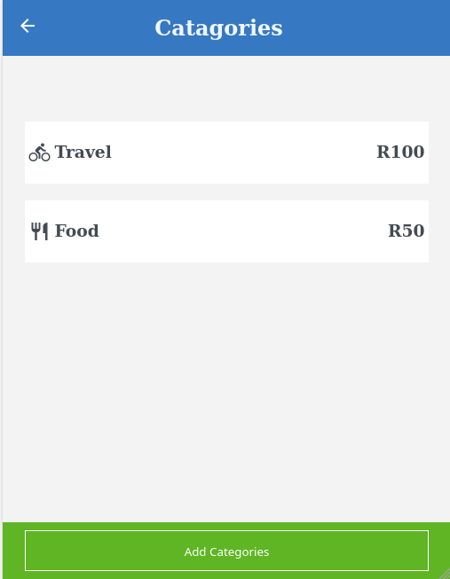
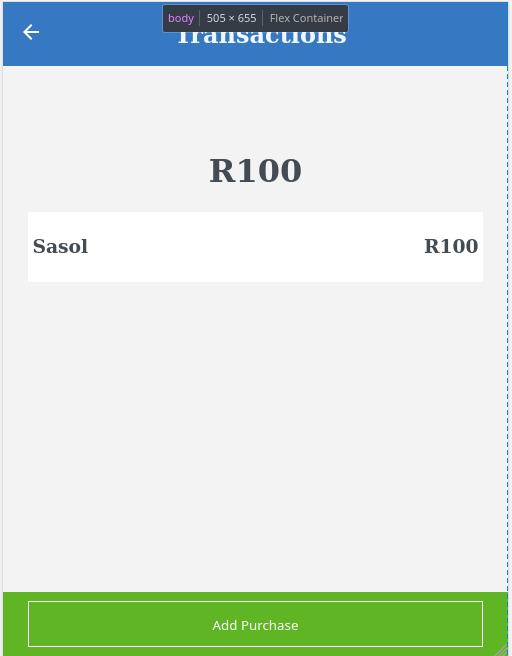

# Budget

>  A mobile web application where you can manage your budget: you have a list of transactions associated with a category, so that you can see how much money you spent and on what.

## Demo

 - [Checkout my demo](https://shielded-everglades-50642.herokuapp.com/)

## Built with
  - Ruby
  - Rails
  - Postgresql

## Getting Started

This repository makes use of Ruby as its core programming language :

- [Clone this repo](https://github.com/Lockless404/budget-app)
 `git clone https://github.com/Lockless404/budget-app.git` in your PC terminal
- Navigate to project's folder/directory
  `cd budget-app`
- Enter `bundle install` to install dependencies.
- Enter `rails db:create db:migrate` to populate the database
- Enter `rspec` to run tests.
- Enter `rails s` and navigate to `http://localhost:3000/` on your web browser to view the website.

## Authors

👤 **Hamza Tarar**

- GitHub: [@Lockless404](https://github.com/Lockless404)
- Twitter: [@hamza_tarar10](https://twitter.com/hamza_tarar10)
- LinkedIn: [Hamza Tarar](https://www.linkedin.com/in/hamzaalitarar/)

## 🤝 Contributing

Contributions, issues, and feature requests are welcome!

Feel free to check the [issues page](../../issues/).

## Show your support

Give a ⭐️ if you like this project!

## Acknowledgments

- Original design idea by Gregoire Vella on Behance.
- The Creative Commons license of the design credit to the author.

## 📝 License

This project is [MIT](./MIT.md) licensed.
